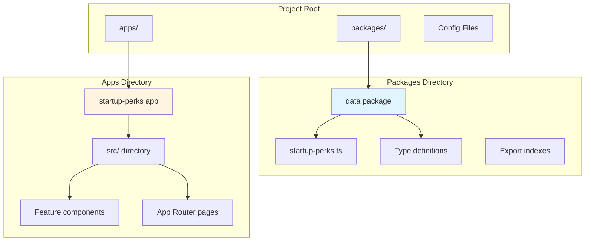

# Startup Perks Directory - Monorepo Migration Plan

## Overview

Transform the existing Startup Perks single-app project into a production-grade monorepo following Directories' architecture, with enhanced SEO optimization, advanced search/filtering capabilities, and community contributions via GitHub PRs.

## Implementation Progress

### ✅ Completed

- **Phase 1: Monorepo Setup**
  - Root workspace configuration with npm workspaces
  - Biome linting and formatting setup
  - VSCode settings for team consistency
  - Git ignore configuration

- **Phase 2: Data Package**
  - Created `@directories/data` package
  - Migrated all 40+ startup perks with full data
  - Implemented helper functions: `getPerksByCategory`, `getFeaturedPerks`, `getPerkById`, `getCategories`
  - Added popular/featured perks utilities
  - Full TypeScript types and JSDoc documentation

### 🚧 In Progress

- **Phase 3: Next.js App Setup**
  - Created app directory structure
  - Configured Next.js 16 with App Router
  - Set up Tailwind CSS
  - Configured TypeScript with proper path aliases
  - Created feature-based component folders

### 📋 Pending

- SEO infrastructure (layout, metadata, sitemap, robots.txt)
- JSON-LD schema generators
- Component implementation
- Search and filter functionality
- Page implementation with SEO
- Data queries layer
- Contribution guidelines and AGENTS.md
- Testing and optimization

### 📁 Current Structure

```
startup_perks/
├── packages/
│   └── data/               ✅ Complete
│       ├── package.json
│       ├── tsconfig.json
│       └── src/
│           ├── perks/
│           │   ├── startup-perks.ts    (698 lines, 40+ perks)
│           │   └── index.ts            (exports & helpers)
│           └── popular/
│               └── index.ts
├── apps/
│   └── startup-perks/      🚧 In Progress
│       ├── package.json    ✅
│       ├── tsconfig.json   ✅
│       ├── tailwind.config.ts ✅
│       ├── next.config.mjs ✅
│       └── src/
│           ├── app/        📋 Next
│           ├── components/ 📋 Next
│           ├── lib/        📋 Next
│           └── data/       📋 Next
├── .vscode/
│   └── settings.json       ✅
├── biome.json              ✅
├── package.json            ✅
└── .gitignore              ✅
```

## Architecture Overview



## SEO Optimization Analysis

**Directories' SEO Features (to implement):**

- Dynamic metadata per page using `generateMetadata()`
- Sitemap generation with priorities and change frequencies
- Static generation with ISR (revalidate: 86400)
- OpenGraph and Twitter Card metadata
- Structured page titles with brand suffix
- Semantic HTML with proper heading hierarchy

**Missing from Directories (to add):**

- No robots.txt file
- No JSON-LD structured data (Schema.org)
- No canonical URLs
- Limited meta descriptions

## Project Structure

New directory structure:

```
startup_perks/
├── packages/
│   └── data/
│       ├── package.json
│       ├── tsconfig.json
│       └── src/
│           ├── perks/
│           │   ├── index.ts          # Export all perks
│           │   └── startup-perks.ts  # Migrated data
│           └── popular/
│               └── index.ts          # Featured/popular perks
├── apps/
│   └── startup-perks/
│       ├── package.json
│       ├── next.config.mjs
│       ├── tailwind.config.ts
│       ├── biome.json
│       ├── tsconfig.json
│       ├── public/
│       │   ├── favicon.svg
│       │   └── og-image.png
│       └── src/
│           ├── app/
│           │   ├── layout.tsx         # Root layout with SEO metadata
│           │   ├── page.tsx           # Homepage
│           │   ├── sitemap.ts         # Dynamic sitemap
│           │   ├── robots.ts          # Robots.txt generator
│           │   ├── manifest.ts        # PWA manifest
│           │   ├── globals.css
│           │   └── perks/
│           │       ├── page.tsx       # Perks listing
│           │       ├── loading.tsx
│           │       ├── [category]/
│           │       │   └── page.tsx   # Category pages with metadata
│           │       └── [id]/
│           │           └── page.tsx   # Individual perk pages
│           ├── components/
│           │   ├── ui/               # shadcn components
│           │   ├── perks/            # Feature-organized
│           │   │   ├── perk-card.tsx
│           │   │   ├── perk-list.tsx
│           │   │   ├── search-input.tsx
│           │   │   ├── category-filter.tsx
│           │   │   ├── value-range-filter.tsx
│           │   │   ├── featured-filter.tsx
│           │   │   ├── filter-panel.tsx
│           │   │   └── featured-grid.tsx
│           │   ├── layout/
│           │   │   ├── header.tsx
│           │   │   └── footer.tsx
│           │   └── shared/
│           │       └── stats-section.tsx
│           ├── lib/
│           │   ├── utils.ts
│           │   ├── seo.ts            # SEO utility functions
│           │   └── constants.ts      # Site config
│           └── data/
│               └── queries.ts        # Data fetching layer
├── .vscode/
│   └── settings.json                 # Biome configuration
├── .github/
│   ├── ISSUE_TEMPLATE/
│   │   └── perk-submission.yml       # Structured perk submission
│   └── pull_request_template.md      # PR template
├── .cursor/
│   └── rules/
│       └── AGENTS.md                 # AI coding assistant rules
├── CONTRIBUTING.md                   # Contribution guidelines
├── package.json                      # Workspace config
├── biome.json                        # Root linting config
└── README.md
```

## Implementation Steps

### Phase 1: Monorepo Setup

1. **Initialize workspace structure**

   - Create root `package.json` with workspaces: `["packages/*", "apps/*"]`
   - Install Biome as dev dependency at root level
   - Configure Biome with root `biome.json`
   - Setup `.vscode/settings.json` for team consistency

2. **Create data package** (`packages/data/`)

   - Initialize package with proper exports configuration
   - Migrate [src/data/startup-perks.ts](../Startup-Perks/src/data/startup-perks.ts) content
   - Create index exports: `./perks` and `./popular`
   - Add `getFeaturedPerks()`, `getPerksByCategory()`, `getPerkById()` helper functions
   - Setup TypeScript with proper module resolution

3. **Create main app** (`apps/startup-perks/`)

   - Initialize Next.js 16 with App Router
   - Configure `next.config.mjs` (basic, clean like current Startup-Perks)
   - Setup Tailwind with Directories' clean config (no brutal shadows)
   - Install dependencies: shadcn, radix-ui, next-themes, etc.

### Phase 2: SEO Infrastructure

Reference: [src/app/layout.tsx](../directories/apps/cursor/src/app/layout.tsx) and [src/app/sitemap.ts](../directories/apps/cursor/src/app/sitemap.ts)

4. **Root Layout with comprehensive metadata**
   ```typescript
   // apps/startup-perks/src/app/layout.tsx
   export const metadata: Metadata = {
     metadataBase: new URL('https://startupperks.directory'),
     title: {
       default: 'Startup Perks Directory',
       template: '%s | Startup Perks Directory'
     },
     description: 'Discover $1M+ in free cloud credits, AI API access, and developer tools for startups',
     keywords: ['startup credits', 'startup perks', 'free credits', 'cloud credits', 'AI credits'],
     authors: [{ name: 'Your Name' }],
     openGraph: {
       type: 'website',
       locale: 'en_US',
       url: 'https://startupperks.directory',
       title: 'Startup Perks Directory',
       description: 'Discover $1M+ in free credits and tools for startups',
       siteName: 'Startup Perks Directory',
       images: [{ url: '/og-image.png', width: 1200, height: 630 }]
     },
     twitter: {
       card: 'summary_large_image',
       title: 'Startup Perks Directory',
       description: 'Discover $1M+ in free credits and tools for startups',
       images: ['/og-image.png']
     },
     robots: {
       index: true,
       follow: true,
       googleBot: {
         index: true,
         follow: true,
         'max-video-preview': -1,
         'max-image-preview': 'large',
         'max-snippet': -1
       }
     }
   }
   ```

5. **Dynamic sitemap generation**

   - Create `src/app/sitemap.ts`
   - Include all perks with `generateStaticParams()`
   - Include category pages
   - Set proper priorities: homepage (1.0), categories (0.9), individual perks (0.7)
   - Set `changeFrequency: 'weekly'` for perks

6. **Robots.txt generator**
   ```typescript
   // src/app/robots.ts
   export default function robots(): MetadataRoute.Robots {
     return {
       rules: {
         userAgent: '*',
         allow: '/',
         disallow: ['/api/', '/private/']
       },
       sitemap: 'https://startupperks.directory/sitemap.xml'
     }
   }
   ```

7. **JSON-LD Structured Data** (NEW - not in Directories)

   - Create `src/lib/seo.ts` with schema generators
   - Add Organization schema to layout
   - Add WebSite schema with search action
   - Add ItemList schema for perk listings
   - Add Article schema for individual perks

8. **Per-page metadata with generateMetadata()**

   - Implement on `/perks/[id]/page.tsx` - unique titles, descriptions per perk
   - Implement on `/perks/[category]/page.tsx` - category-specific metadata
   - Add canonical URLs to prevent duplicate content
   - Include OpenGraph images per perk category

### Phase 3: Component Migration

9. **Setup component architecture** (feature-based like Directories)

   - Create `src/components/ui/` - port shadcn components from current project
   - Create `src/components/perks/` - feature-organized perk components
   - Create `src/components/layout/` - header, footer
   - Create `src/components/shared/` - stats, badges, etc.

10. **Migrate and refactor components**

    - Port components from [components/](../Startup-Perks/components/)
    - Rename to kebab-case following Directories convention
    - Update imports to use `@directories/data` package for types
    - Apply clean Directories design (remove brutal shadows, update colors)
    - Ensure proper TypeScript types throughout

### Phase 4: Page Implementation

11. **Homepage** (`src/app/page.tsx`)

    - Port from [app/page.tsx](../Startup-Perks/app/page.tsx)
    - Simplify design to match Directories aesthetic
    - Keep hero, stats, featured grid, categories
    - Add proper semantic HTML (h1, h2, sections with aria labels)
    - Add JSON-LD WebSite schema

12. **Perks listing** (`src/app/perks/page.tsx`)

    - Implement advanced search and filtering using `nuqs` for URL state
    - **Search functionality:**
      - Full-text search across company name, perk name, description, eligibility
      - Real-time search as user types (debounced)
      - Highlight matching terms in results
    - **Filter options:**
      - Category multi-select (cloud, AI, database, etc.)
      - Credit value ranges (e.g., "$0-$10k", "$10k-$50k", "$50k+")
      - Featured perks toggle
      - Sort by: alphabetical, company name, credit value (estimated)
    - **URL state management:**
      - All filters persist in URL query params
      - Shareable filtered URLs
      - Browser back/forward works correctly
    - Add `generateMetadata()` with dynamic title based on active filters
    - Add JSON-LD ItemList schema
    - Implement loading states with Suspense
    - Show result count and active filters
    - Clear filters button

13. **Category pages** (`src/app/perks/[category]/page.tsx`)

    - Implement `generateStaticParams()` for all 8 categories
    - Dynamic metadata per category
    - Prerender at build time with `export const dynamic = 'force-static'`
    - Add `revalidate: 86400` (24 hours) like Directories
    - Category-specific descriptions and keywords

14. **Individual perk pages** (`src/app/perks/[id]/page.tsx`)

    - Reference: [src/app/[slug]/page.tsx](../directories/apps/cursor/src/app/[slug]/page.tsx)
    - Implement `generateStaticParams()` for all perks
    - Rich metadata: title with company name, full description
    - Add canonical URL
    - Add JSON-LD Article/Product schema with:
      - name, description, provider (company)
      - offers (credit value)
      - aggregateRating (if adding reviews later)
    - OpenGraph image (could generate dynamic per category)
    - Structured content with proper headings (h1 for name, h2 for sections)

### Phase 5: Data Layer

15. **Create data queries** (`src/data/queries.ts`)

    - Similar to [src/data/queries.ts](../directories/apps/cursor/src/data/queries.ts)
    - Pure functions that import from `@directories/data/perks`
    - **Core query functions:**
      - `getAllPerks()` - get all perks
      - `getPerkById(id)` - single perk lookup
      - `getPerksByCategory(category)` - filter by category
      - `getFeaturedPerks()` - featured only
      - `getCategories()` - list all categories with counts
      - `getStats()` - total perks, total value, category breakdown
    - **Search and filter functions:**
      - `searchPerks(query)` - full-text search with fuzzy matching
      - `filterPerks(options)` - advanced filtering:
        - categories: string[]
        - searchQuery: string
        - valueRange: 'low' | 'medium' | 'high' | 'all'
        - featuredOnly: boolean
        - sortBy: 'name' | 'company' | 'value'
      - `extractCreditValue(creditsString)` - parse credit amounts for sorting/filtering
    - Ensure all functions are TypeScript-safe with proper return types

16. **Update data package exports**

    - Configure proper package.json exports
    - Export types: `StartupPerk`, `PerkCategory`
    - Export constants: `categoryLabels`, `categoryColors`
    - Export helper functions

### Phase 6: SEO Enhancements (Beyond Directories)

17. **Create SEO utilities** (`src/lib/seo.ts`)

    - `generatePerkSchema()` - JSON-LD for individual perks
    - `generateWebSiteSchema()` - site-level schema
    - `generateBreadcrumbSchema()` - for navigation
    - `generateOrganizationSchema()` - about your directory

18. **Optimize meta descriptions**

    - Write compelling, unique descriptions for each perk (80-160 chars)
    - Include value proposition and key benefits
    - Add call-to-action language

19. **Implement canonical URLs**

    - Add to all page metadata
    - Prevent duplicate content issues
    - Especially important for filtered/sorted views

20. **Add breadcrumbs**

    - Visual breadcrumbs component
    - JSON-LD BreadcrumbList schema
    - Improves navigation and SEO

### Phase 7: Performance & PWA

21. **Optimize images and assets**

    - Use Next.js Image component throughout
    - Add proper alt text for accessibility and SEO
    - Optimize OG image (1200x630px)
    - Generate favicon variants

22. **PWA manifest** (`src/app/manifest.ts`)
    ```typescript
    export default function manifest(): MetadataRoute.Manifest {
      return {
        name: 'Startup Perks Directory',
        short_name: 'Perks',
        description: 'Discover startup credits and perks',
        start_url: '/',
        display: 'standalone',
        background_color: '#ffffff',
        theme_color: '#000000',
        icons: [/* favicon variants */]
      }
    }
    ```

23. **Performance optimization**

    - Static generation for all perk pages
    - ISR with 24-hour revalidation
    - Implement proper loading states
    - Add Suspense boundaries
    - Optimize bundle size

### Phase 8: Community Contributions

24. **Create contribution infrastructure**

    - **CONTRIBUTING.md file:**
      - Explain the GitHub PR workflow for adding perks
      - Step-by-step guide to editing `packages/data/src/perks/startup-perks.ts`
      - Code formatting requirements (Biome)
      - Required fields for perk data
      - How to run locally and test
    - **GitHub Issue Template** (`.github/ISSUE_TEMPLATE/perk-submission.yml`):
      - Structured form with required fields:
        - Company Name
        - Program Name
        - Category (dropdown)
        - Credit Value/Discount
        - Description
        - Eligibility Requirements
        - Apply URL
        - Source/verification URL
        - Additional notes (optional)
      - Template auto-labels as "new-perk"
    - **Pull Request Template** (`.github/pull_request_template.md`):
      - Checklist for contributors:
        - [ ] Added perk to startup-perks.ts
        - [ ] Verified URL is correct
        - [ ] Checked for duplicates
        - [ ] Ran `npm run lint`
        - [ ] Tested locally
      - Section for perk details summary
      - Link to CONTRIBUTING.md

25. **Add "Contribute" page** (`src/app/contribute/page.tsx`)

    - Explain how to add perks via GitHub PR
    - Embed contribution guidelines
    - Link to GitHub repo
    - Show recent contributors (using GitHub API if desired)
    - Add SEO metadata for this page
    - Link from header/footer

26. **README updates for contributors**

    - Add "Contributing" section prominently
    - Link to CONTRIBUTING.md
    - Badge showing number of perks
    - Badge for contributors welcome
    - Quick start for local development

### Phase 9: Development Tools

27. **Configure Biome**

    - Port settings from [biome.json](../directories/biome.json)
    - Setup format on save
    - Auto-organize imports
    - Configure linting rules

28. **VSCode workspace settings**

    - Port from [.vscode/settings.json](../directories/.vscode/settings.json)
    - Ensure consistent formatting across team
    - Configure TypeScript workspace version

29. **Update README**

    - Document monorepo structure
    - Explain workspace package pattern
    - Add development, build, and deployment instructions
    - Include SEO best practices section

30. **Create AGENTS.md** (`.cursor/rules/AGENTS.md`)

    - **Architecture patterns from Directories:**
      - Monorepo with workspace packages structure
      - Feature-based component organization (not by type)
      - Server actions in `/actions` folder (though not used in this project)
      - Data queries in `/data` folder
      - Path aliases: `@/*` points to `src/*` (not root)
    - **Coding conventions:**
      - Use Biome for linting and formatting
      - Kebab-case for component files (e.g., `perk-card.tsx`)
      - PascalCase for component names (e.g., `PerkCard`)
      - Prefer named exports over default exports for components
      - Use `"use client"` directive only when necessary
    - **Component patterns:**
      - Feature folders: `/components/perks/`, `/components/layout/`
      - UI primitives in `/components/ui/` (shadcn)
      - Co-locate related components in feature folders
    - **Data fetching patterns:**
      - All data imports from `@directories/data/perks`
      - Pure functions in `src/data/queries.ts`
      - No direct data imports in components
      - Use server components by default
    - **Next.js App Router patterns:**
      - Use `generateMetadata()` for SEO
      - Use `generateStaticParams()` for static generation
      - Add `revalidate: 86400` for ISR
      - Use `dynamic = 'force-static'` where appropriate
    - **SEO requirements:**
      - Every page must have unique metadata
      - Include OpenGraph and Twitter Card tags
      - Add JSON-LD structured data via `src/lib/seo.ts`
      - Use semantic HTML with proper heading hierarchy
    - **TypeScript standards:**
      - Strict mode enabled
      - Explicit return types for functions
      - No `any` types
      - Use interfaces for props, types for unions
    - **Styling conventions:**
      - Use Tailwind utility classes
      - HSL CSS variables for colors
      - Use `cn()` utility from `lib/utils.ts` for conditional classes
      - Support dark mode via next-themes
    - **State management:**
      - Use `nuqs` for URL state (search, filters)
      - React Context for global client state if needed
      - No Redux or external state management
    - **File naming:**
      - Components: kebab-case (e.g., `search-filter.tsx`)
      - Utilities: kebab-case (e.g., `seo.ts`)
      - Types: PascalCase suffix (e.g., `StartupPerk`)
    - **Import organization (Biome auto-sorts):**
      - React imports first
      - Third-party libraries
      - Internal imports (`@/...`)
      - Relative imports
      - Type imports last

### Phase 10: Testing & Validation

31. **SEO validation**

    - Test with Google Rich Results Test
    - Validate sitemap in Google Search Console
    - Check meta tags with browser extensions
    - Verify OpenGraph with Facebook Debugger
    - Test Twitter Cards with Card Validator

32. **Accessibility audit**

    - Run Lighthouse tests (aim for 100 on SEO)
    - Verify semantic HTML
    - Test keyboard navigation
    - Check color contrast ratios

33. **Cross-browser testing**

    - Test on Chrome, Firefox, Safari
    - Verify mobile responsiveness
    - Check social media previews

## Key Technical Decisions

### Path Aliases

Use `@/*` pointing to `src/*` (not root), following Directories pattern:

```json
{
  "compilerOptions": {
    "paths": { "@/*": ["./src/*"] }
  }
}
```

### Static Generation Strategy

- All pages use `generateStaticParams()` for SSG
- Add `revalidate: 86400` for daily updates
- Use `dynamic = 'force-static'` where appropriate

### Data Management

- All perk data in `packages/data/src/perks/startup-perks.ts`
- Import via `@directories/data/perks`
- Helper functions in same package for data operations

### Search & Filter Implementation

- Use `nuqs` for URL state management (like Directories)
- Client-side filtering for instant results (no backend needed)
- Debounced search input (300ms) to avoid excessive re-renders
- Filter state persists in URL:
  - `?search=cloudflare&category=cloud,ai&featured=true&sort=value`
- All filtering logic in `src/data/queries.ts`
- Full-text search across multiple fields with case-insensitive matching
- Credit value extraction and parsing for range filters

### Community Contribution Model

- Open-source, GitHub PR-based submissions
- No authentication required to view or use
- Structured GitHub issue template for perk submissions
- Clear CONTRIBUTING.md with step-by-step instructions
- Maintainer reviews PRs for accuracy and completeness
- Contributors credited in README or dedicated page

### Design System

- Use Directories' clean Tailwind config
- Remove Neo-Brutalism (brutal-shadow classes, etc.)
- Keep standard shadcn component styling
- Use HSL CSS variables for theming
- Support dark mode with next-themes

## SEO Checklist

**Technical SEO:**

- [x] Semantic HTML5 structure
- [x] Dynamic metadata per page
- [x] OpenGraph tags
- [x] Twitter Card tags
- [x] Sitemap.xml generation
- [x] Robots.txt
- [x] Canonical URLs
- [x] JSON-LD structured data
- [x] Mobile-responsive design
- [x] Fast page loads (static generation)

**Content SEO:**

- [ ] Unique titles per page (50-60 chars)
- [ ] Compelling meta descriptions (150-160 chars)
- [ ] Proper heading hierarchy (h1 > h2 > h3)
- [ ] Descriptive alt text for images
- [ ] Internal linking between perks
- [ ] Content-rich perk descriptions

**Social SEO:**

- [x] OpenGraph images (1200x630)
- [x] Twitter Card configuration
- [ ] Social sharing buttons
- [ ] Branded imagery

## Migration vs Fresh Start

**Recommended approach:** Fresh monorepo creation, selective migration

**Copy directly:**

- Perk data from `src/data/startup-perks.ts`
- Type definitions
- README structure

**Rewrite/refactor:**

- All components (to match Directories architecture)
- Page structure (to use feature-based organization)
- Styling (to match Directories aesthetic)
- Configuration files (to use Biome, workspace setup)

## Files Reference

**Study these Directories files:**

- [apps/cursor/src/app/layout.tsx](../directories/apps/cursor/src/app/layout.tsx) - SEO metadata patterns
- [apps/cursor/src/app/sitemap.ts](../directories/apps/cursor/src/app/sitemap.ts) - Sitemap generation
- [apps/cursor/src/app/[slug]/page.tsx](../directories/apps/cursor/src/app/[slug]/page.tsx) - Dynamic metadata
- [apps/cursor/src/components/rule-card.tsx](../directories/apps/cursor/src/components/rule-card.tsx) - Component patterns
- [apps/cursor/src/data/queries.ts](../directories/apps/cursor/src/data/queries.ts) - Data fetching layer
- [packages/data/package.json](../directories/packages/data/package.json) - Package exports
- [packages/data/src/rules/index.ts](../directories/packages/data/src/rules/index.ts) - Data organization
- [biome.json](../directories/biome.json) - Linting/formatting config
- [.vscode/settings.json](../directories/.vscode/settings.json) - Editor config

**Migrate from Startup-Perks:**

- [src/data/startup-perks.ts](../Startup-Perks/src/data/startup-perks.ts) - Core data (650+ lines)
- Component logic (but redesign UI)
- Color scheme for categories

## AGENTS.md Content Preview

The AGENTS.md file will serve as the single source of truth for AI coding assistants, ensuring consistency with Directories architecture:

**Key sections:**

1. **Project Architecture** - Monorepo structure, workspace packages, feature-based organization
2. **File Structure Conventions** - Where to put components, utils, data queries, types
3. **Naming Conventions** - Kebab-case files, PascalCase components, clear patterns
4. **Component Patterns** - Server vs client components, props patterns, composition
5. **Data Patterns** - How to fetch, filter, and query perk data
6. **Routing Patterns** - generateMetadata, generateStaticParams, revalidation
7. **Styling Patterns** - Tailwind usage, cn() utility, dark mode, HSL variables
8. **SEO Patterns** - Metadata structure, JSON-LD, canonical URLs, sitemaps
9. **TypeScript Patterns** - Strict types, no any, interface vs type usage
10. **Testing Patterns** - What to test, how to validate SEO and accessibility

This ensures every AI interaction follows the exact same architectural decisions as Directories.

## Success Criteria

- [ ] Monorepo builds successfully
- [ ] All perk pages statically generated
- [ ] Sitemap includes all 40+ perks
- [ ] Lighthouse SEO score: 100
- [ ] All pages have unique metadata
- [ ] JSON-LD validates in Rich Results Test
- [ ] Clean, professional Directories-style design
- [ ] Sub-second page loads
- [ ] Mobile-responsive
- [ ] Dark mode functional
- [ ] Advanced search works across all fields
- [ ] Category filters work with multiple selections
- [ ] Credit value range filters work correctly
- [ ] Sort functionality works (name, company, value)
- [ ] URL state persists and is shareable
- [ ] Clear filters button resets all filters
- [ ] CONTRIBUTING.md is clear and actionable
- [ ] GitHub issue template captures all required fields
- [ ] PR template has proper checklist
- [ ] /contribute page explains submission process
- [ ] AGENTS.md file created with all coding conventions
- [ ] AI assistants can reference AGENTS.md for consistency